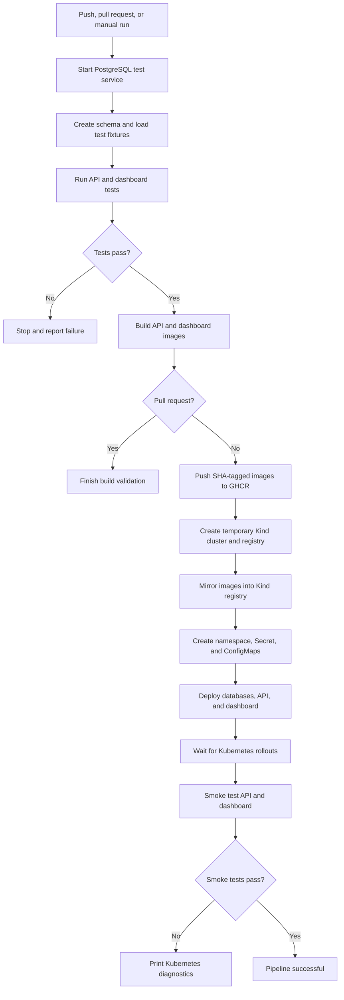

# DST Airlines DevOps Progress: Steps 1-5

This document records the work implemented for project requirement Steps 1
through 5. It only describes changes that exist in the repository or checks
that were completed locally.

## Status Key

- **Implemented:** The required files or configuration exist.
- **Verified:** The implementation was tested successfully locally.
- **Configured, pending:** The implementation exists but still requires its
  first GitHub-hosted workflow run.
- **Not implemented:** The item is outside the completed work.

## Overall Status

| Step | Requirement | Status | Evidence |
| --- | --- | --- | --- |
| 1 | Dockerize the application | Implemented and locally verified | API and dashboard images build and their HTTP checks pass |
| 2 | Separate development and production environments | Implemented and locally verified | Development and production Compose configurations validate |
| 3 | Add automated tests | Implemented and locally verified | 47 API tests and 34 dashboard tests pass |
| 4 | Deploy with Kubernetes | Manifests implemented; full rollout pending | Kind cluster creation works, but the complete local rollout was blocked by disk space |
| 5 | Automate CI/CD | Configured, pending first GitHub run | Workflow syntax validates locally; it has not yet run on GitHub |

## Step 1: Dockerize the Application

### Implemented

- The FastAPI service has its own Docker image definition in
  `api/Dockerfile`.
- The Dash dashboard has its own Docker image definition in
  `dashboard/Dockerfile`.
- The dashboard Dockerfile installs dependencies from
  `dashboard/requirements.txt`.
- Docker Compose defines the application and supporting database services.
- The API and dashboard expose HTTP endpoints that can be used for container
  health verification.
- The CI/CD workflow is configured to build both application images.
- Non-pull-request workflow runs are configured to publish commit-specific
  image tags to GitHub Container Registry (GHCR).

### Verified Locally

| Check | Result |
| --- | --- |
| API Docker image build | Passed |
| Dashboard Docker image build | Passed |
| API container HTTP check | Passed |
| Dashboard container HTTP check | Passed |

### Not Yet Completed

- No image has been published to GHCR yet because the workflow has not been
  pushed and run on GitHub.
- Multi-stage Docker builds have not been implemented.

## Step 2: Development and Production Environments

### Implemented

- `docker-compose.dev.yml` defines the development environment.
- `docker-compose.prod.yml` defines the production-oriented environment.
- `.env.dev` and `.env.prod` provide environment-specific configuration.
- Development enables debugging while production disables it.
- Development and production use separate container and volume names.
- The workflow supports the `dev-ali`, `dev`, and `main` branches.

### Verified Locally

| Check | Result |
| --- | --- |
| Development Compose configuration | Valid |
| Production Compose configuration | Valid |

### Not Yet Completed

- There is no persistent remote development or production deployment.
- A production approval gate has not been configured.
- Kubernetes currently uses one namespace rather than separate development and
  production namespaces.

## Step 3: Automated Tests

### Implemented

- Existing API and dashboard tests are included in the automated workflow.
- `requirements-test.txt` contains test-only dependencies.
- `database/sql/test_seed.sql` provides deterministic PostgreSQL test data.
- The test job starts PostgreSQL 16, creates the schema, loads fixtures, and
  then runs the tests.
- Tests execute before image publication or Kubernetes deployment.

### Verified Locally

| Test suite | Result |
| --- | --- |
| API tests | 47 passed |
| Dashboard tests | 34 passed |
| Total | 81 passed |

The earlier API failures were caused by PostgreSQL and the required seed data
not being available. They were not caused by missing personal credentials.

## Step 4: Kubernetes Deployment

### Implemented

The `k8s` directory contains Kubernetes resources for:

- Namespace
- FastAPI Deployment and Service
- Dash dashboard Deployment and Service
- PostgreSQL Deployment, Service, persistent storage, and initialization
- MongoDB Deployment, Service, and persistent storage
- Neo4j Deployment, Service, and persistent storage
- Shared application ConfigMap
- Runtime Secret example

The following deployment improvements were added:

- API readiness and liveness probes
- Dashboard readiness and liveness probes
- PostgreSQL readiness probe
- PostgreSQL schema initialization through a ConfigMap
- Image placeholders that allow CI to inject immutable image versions
- Neo4j authentication read from a Kubernetes Secret
- Removal of the committed runtime `k8s/secret.yaml`
- Addition of the safe template `k8s/secret.example.yaml`

Kubernetes Services provide internal DNS names so the containers can
communicate inside the cluster. Kubernetes is orchestrating the containers; it
does not replace the APIs used by the application.

### Verification Status

| Check | Result |
| --- | --- |
| Kubernetes YAML parsing | Passed |
| Local Kind cluster creation | Passed |
| Complete local rollout | Not completed because local disk space was exhausted |
| GitHub-hosted Kubernetes rollout | Pending first workflow run |

The workflow uses a temporary Kind cluster and a local Kind registry. This
validates that the complete stack can be deployed, but it is not a persistent
production deployment.

## Step 5: CI/CD Pipeline

### Implemented

The GitHub Actions workflow is located at
`.github/workflows/ci-cd.yml`.

It is configured to:

1. Run on pull requests and pushes for `dev-ali`, `dev`, and `main`.
2. Support manual execution with `workflow_dispatch`.
3. Start a PostgreSQL service.
4. Initialize the database schema and deterministic fixtures.
5. Run 47 API tests and 34 dashboard tests.
6. Build the API and dashboard images with Docker Buildx.
7. Stop after build validation for pull requests.
8. Tag images with the Git commit SHA for non-pull-request runs.
9. Authenticate to GHCR with the repository `GITHUB_TOKEN`.
10. Push the images to GHCR.
11. Create a temporary Kind cluster with a local registry.
12. Pull the published images and mirror them into the Kind registry.
13. Create the namespace, runtime Secret, and initialization ConfigMap.
14. Deploy PostgreSQL, MongoDB, Neo4j, FastAPI, and Dash.
15. Wait for all Kubernetes rollouts.
16. Smoke test the API and dashboard.
17. Print pod, event, and log diagnostics when deployment fails.

### Workflow Behavior

```text
Pull request to dev-ali, dev, or main
    -> tests and Docker build validation

Push to dev-ali, dev, or main
    -> tests, GHCR image publication, Kind deployment, and smoke tests

Manual workflow dispatch
    -> full pipeline
```

### Image Versioning

The workflow is configured to publish:

```text
ghcr.io/<repository-owner>/dst-airlines-api:<commit-sha>
ghcr.io/<repository-owner>/dst-airlines-dashboard:<commit-sha>
```

SHA tags identify the exact source revision used to build each image and provide
a stable rollback target.

### Workflow Diagram



### CI/CD Verification Status

| Check | Result |
| --- | --- |
| GitHub Actions YAML parsing | Passed |
| Local application tests | 81 passed |
| Local Docker image builds | Passed |
| Git whitespace validation | Passed |
| First GitHub Actions run | Pending |
| Images visible in GHCR | Pending |
| Complete Kind deployment in GitHub Actions | Pending |
| CI smoke tests | Pending |

## Files Added

| File | Purpose |
| --- | --- |
| `.github/workflows/ci-cd.yml` | Test, image build, GHCR publication, Kind deployment, and smoke-test workflow |
| `requirements-test.txt` | Test-only Python dependencies |
| `database/sql/test_seed.sql` | Deterministic PostgreSQL fixtures for API tests |
| `k8s/secret.example.yaml` | Safe documentation of required Kubernetes Secret keys |
| `docs/CI_CD.md` | CI/CD operation and deployment documentation |
| `README-hassan.mmd` | Standalone Mermaid workflow source |

## Files Updated

| File or area | Change |
| --- | --- |
| `dashboard/Dockerfile` | Uses the dashboard requirements file |
| Kubernetes API and dashboard deployments | Added health probes and injectable image names |
| Kubernetes PostgreSQL deployment | Added readiness checking and schema initialization |
| Kubernetes Neo4j deployment | Reads authentication from a Secret |
| `.gitignore` | Ignores environment-specific files while allowing examples |

## Remaining Work

The implementation should not be described as fully deployed until these steps
are completed:

1. Review and commit the local changes on `dev-ali`.
2. Push `dev-ali` to GitHub.
3. Confirm GitHub Actions has package write permission.
4. Run the workflow on a clean GitHub-hosted runner.
5. Confirm that both images appear in GHCR.
6. Confirm the Kind rollouts and API/dashboard smoke tests pass.
7. Record the successful workflow URL or screenshot as project evidence.

For a persistent deployment, an external Kubernetes cluster or a self-hosted
runner is still required. Kind in GitHub Actions is temporary and is deleted
when the job ends.

## Credential and Repository Safety

- The workflow uses temporary PostgreSQL and Kubernetes credentials.
- GHCR authentication uses the repository-provided `GITHUB_TOKEN`.
- Real development or production credentials must not be committed.
- `.env`, `.env.dev`, and `.env.prod` were already tracked in earlier commits.
  Adding them to `.gitignore` does not remove them from Git history.
- Existing exposed credentials should be rotated and repository history should
  be reviewed separately.

GitHub Actions must be allowed to write packages:

```text
Repository Settings
-> Actions
-> General
-> Workflow permissions
-> Read and write permissions
```
