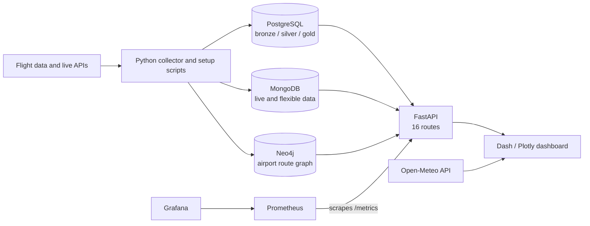
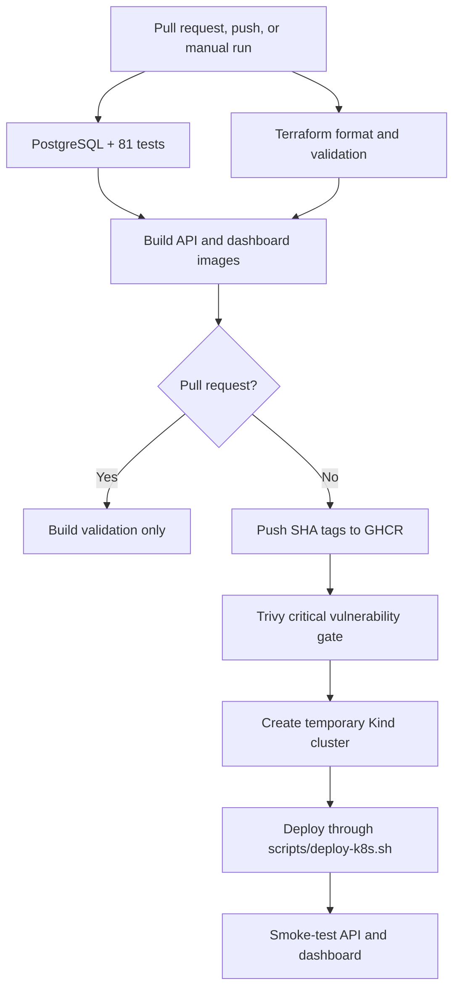
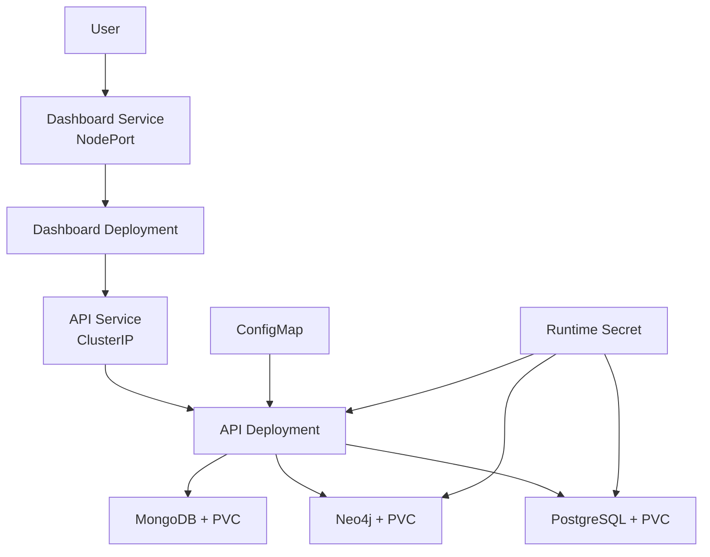
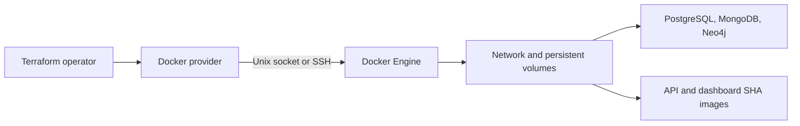

# DST Airlines DataOps

**LIORA DataOps Project | June 2026 Batch**

Flight-delay analytics platform built with FastAPI, Dash, PostgreSQL, MongoDB,
Neo4j, Docker, Kubernetes, GitHub Actions, Terraform, Prometheus, and Grafana.

[](https://github.com/kboroz/dst-airlines-DataOps/actions/workflows/ci-cd.yml)

## Project status and ownership

The latest verified `main` run completed the original test, image publishing,
Kind deployment, and smoke-test pipeline successfully on 30 July 2026. The
security and Terraform validation stages added afterward require a new GitHub
Actions run before they can be described as CI-verified.

The Kind cluster is temporary and exists only during CI. It validates
deployment but is not a continuously hosted development or production system.

| Step | Requirement | Owner | Status |
|---|---|---|---|
| 1 | Docker | Ali Doghan and Hassan Salam Banayeem | Implemented |
| 2 | Dev and production configuration | Ali Doghan and Hassan Salam Banayeem | Compose configurations implemented; persistent environments pending |
| 3 | Testing | Hassan Salam Banayeem | 47 API and 34 dashboard tests |
| 4 | Kubernetes | Ali Doghan | Manifests and reusable deployment script; Kind validated |
| 5 | CI/CD | Hassan Salam Banayeem | Test, Terraform validation, build, GHCR, Trivy, Kind, smoke tests |
| 6 | Infrastructure as Code | Ali Doghan | Terraform for local Docker or Docker on a Proxmox guest through SSH |
| 7 | Monitoring | Kristian Boroz | API metrics, Prometheus, Grafana, provisioned dashboard |
| 8 | Security | Ali Doghan | Runtime secret templates, Trivy gate, Dependabot, secret cleanup |
| 9 | Disaster recovery | Ali Doghan | Recovery plan and backup automation; restore exercise pending |
| 10 | Documentation | Ali Doghan and Hassan Salam Banayeem | README, technical guides, diagrams, and Word report |

## Architecture



FastAPI connects to PostgreSQL, MongoDB, and Neo4j. The dashboard reads
application data through FastAPI and calls Open-Meteo for live weather.
Prometheus scrapes API metrics and Grafana visualizes them.

## Technology stack

| Area | Technology |
|---|---|
| API | Python 3.11, FastAPI, Uvicorn |
| Dashboard | Dash, Plotly, Dash Bootstrap Components |
| Data and ML | pandas, scikit-learn, Logistic Regression, Linear Regression |
| Databases | PostgreSQL 16, MongoDB 7, Neo4j 5 |
| Containers | Docker and Docker Compose |
| Orchestration | Kubernetes; Kind in CI and Minikube locally |
| CI/CD and registry | GitHub Actions and GHCR |
| Infrastructure as Code | Terraform Docker provider |
| Monitoring | Prometheus and Grafana |
| Security | Trivy, Dependabot, Kubernetes Secrets, environment variables |

## Repository layout

```text
.
├── .github/
│   ├── dependabot.yml
│   └── workflows/ci-cd.yml
├── api/                            # FastAPI, tests, and Dockerfiles
├── collector/                      # Batch and OpenSky collectors
├── dashboard/                      # Dash UI, charts, weather, ML, and tests
├── database/                       # Setup code and SQL schema/test fixtures
├── docs/CI_CD.md                   # CI/CD implementation details
├── k8s/                            # Kubernetes resources
├── monitoring/                     # Prometheus and Grafana configuration
├── scripts/
│   ├── backup_databases.sh         # Database backup and retention script
│   └── deploy-k8s.sh               # Repeatable Kubernetes deployment
├── terraform/                      # Docker infrastructure as code
├── .env.dev                        # Committed classroom/demo defaults
├── .env.prod                       # Production placeholders; replace before use
├── .env.dev.example                # Development credential template
├── .env.prod.example               # Production credential template
├── .env.k8s.example                # Kubernetes credential/image template
├── docker-compose.yml              # Full local stack
├── docker-compose.dev.yml          # Development stack
├── docker-compose.prod.yml         # Production-oriented stack + monitoring
├── DEPLOYMENT.md
├── DISASTER_RECOVERY.md
├── SECURITY.md
└── DST_Airlines_Documentation.docx
```

## Credentials and configuration

For coursework convenience, this repository includes `.env.dev`, `.env.prod`,
and `terraform/terraform.tfvars`. The development and Terraform files contain
shared demo credentials; `.env.prod` contains replacement placeholders. These
values make local demonstrations easier, but they are public once committed to
Git and must never be reused for an Internet-facing or real production system.

For production, create private runtime files from the provided examples,
replace every placeholder with a unique strong value, and keep the resulting
files outside Git:

```bash
cp .env.dev.example .env.dev
cp .env.prod.example .env.prod
cp .env.k8s.example .env.k8s
cp terraform/terraform.tfvars.example terraform/terraform.tfvars
```

The commands above overwrite the committed demo files locally. Do not commit
the private replacements. Prefer GitHub Environments/Secrets, a secret manager,
or protected environment variables for deployed systems.

| Variable | Used by | What to provide |
|---|---|---|
| `POSTGRES_PASSWORD` | PostgreSQL, API, Terraform, Kubernetes | Unique password, at least 16 characters for Terraform |
| `PGADMIN_DEFAULT_PASSWORD` | pgAdmin in the full Compose stack | Separate local administrator password |
| `NEO4J_PASSWORD` | Neo4j, API, Terraform, Kubernetes | Unique password, at least 16 characters for Terraform |
| `NEO4J_AUTH` | Kubernetes Neo4j container | `neo4j/<NEO4J_PASSWORD>` |
| `DATABASE_URL` | API/dashboard Kubernetes pods | SQLAlchemy URL; URL-encode special characters in the password |
| `GRAFANA_ADMIN_USER` | Grafana | Administrator username, normally `admin` |
| `GRAFANA_ADMIN_PASSWORD` | Grafana | Unique administrator password |
| `API_IMAGE` | Kubernetes | API image visible to the cluster |
| `DASHBOARD_IMAGE` | Kubernetes | Dashboard image visible to the cluster |
| `TF_VAR_docker_host` | Terraform | Local Unix socket or `ssh://user@host:22` |
| `TF_VAR_api_image` | Terraform | Immutable GHCR API SHA tag |
| `TF_VAR_dashboard_image` | Terraform | Immutable GHCR dashboard SHA tag |

Previously committed values must be considered exposed. Removing them from the
latest revision does not remove them from Git history. Rotate them before
reusing any related server or database.

## Run with Docker Compose

### Prerequisites

- Git
- Docker Desktop or Docker Engine with Compose v2

### Clone and configure development

```bash
git clone https://github.com/kboroz/dst-airlines-DataOps.git
cd dst-airlines-DataOps
git switch main
```

The committed `.env.dev` is ready for a local classroom demonstration. Run:

```bash
docker compose --env-file .env.dev -f docker-compose.dev.yml up --build -d
docker compose --env-file .env.dev -f docker-compose.dev.yml ps
```

Development uses API reload, source mounting, debug mode, and development
container/volume names.

### Run the full local stack

The full stack adds pgAdmin, Mongo Express, Prometheus, and Grafana:

```bash
docker compose --env-file .env.dev -f docker-compose.yml up --build -d
docker compose --env-file .env.dev -f docker-compose.yml ps
```

### Run the production-oriented stack

```bash
# Replace every placeholder before continuing.
docker compose --env-file .env.prod -f docker-compose.prod.yml up --build -d
docker compose --env-file .env.prod -f docker-compose.prod.yml ps
```

Production binds API, dashboard, Prometheus, and Grafana to `127.0.0.1` by
default. Put a TLS reverse proxy in front of them. Change `BIND_ADDRESS` only
when host firewall rules are configured. Database ports are not published by
the production Compose file.

The production-oriented file is configuration, not proof of a live production
deployment.

### Service URLs

| Service | URL | Stack |
|---|---|---|
| Dashboard | `http://localhost:8050` | dev, prod, full |
| API health | `http://localhost:8000/` | dev, prod, full |
| API documentation | `http://localhost:8000/docs` | dev, prod, full |
| PostgreSQL | `localhost:5432` | dev and full only |
| MongoDB | `localhost:27017` | dev and full only |
| Neo4j Browser | `http://localhost:7474` | dev and full only |
| pgAdmin | `http://localhost:5050` | full only |
| Mongo Express | `http://localhost:8081` | full only |
| Prometheus | `http://localhost:9090` | prod and full |
| Grafana | `http://localhost:3000` | prod and full |

Stop the selected stack with its matching file:

```bash
docker compose --env-file .env.dev -f docker-compose.dev.yml down
docker compose --env-file .env.prod -f docker-compose.prod.yml down
```

Use `down --volumes` only when deleting the local database data is intentional.

## Tests

The repository contains 81 tests:

- 47 FastAPI endpoint tests using PostgreSQL initialized from
  `database/sql/init.sql` and `database/sql/test_seed.sql`
- 34 dashboard data-layer tests using mocked HTTP responses and fallback data

Install dependencies:

```bash
python -m pip install \
  -r api/requirements.txt \
  -r dashboard/requirements.txt \
  -r requirements-test.txt
```

Run dashboard tests:

```bash
cd dashboard
python -m pytest -q test_data.py
```

API tests require PostgreSQL and `DATABASE_URL`. GitHub Actions creates and
seeds the database automatically. There are no browser end-to-end tests,
coverage threshold, or load tests yet.

## CI/CD pipeline - Step 5



Pipeline file: `.github/workflows/ci-cd.yml`

Triggers:

- Pull requests targeting `main`, `dev`, or `dev-ali`
- Pushes to `main`, `dev`, or `dev-ali`
- Manual `workflow_dispatch`

Pipeline behavior:

1. Start PostgreSQL 16 and load deterministic test data.
2. Run all 81 application tests.
3. Check Terraform formatting, initialize providers, and validate configuration.
4. Build API and dashboard images with Docker Buildx.
5. On non-pull-request runs, publish immutable SHA tags to GHCR.
6. Scan both images for fixed critical vulnerabilities with Trivy.
7. Create a temporary Kind cluster and local registry.
8. Deploy databases, API, and dashboard with runtime Secrets.
9. Wait for rollouts and smoke-test both web services.
10. Print Kubernetes diagnostics on failure.

Image names:

```text
ghcr.io/<repository-owner>/dst-airlines-api:<commit-sha>
ghcr.io/<repository-owner>/dst-airlines-dashboard:<commit-sha>
```

The workflow still does not deploy to a persistent development or production
environment and has no production approval gate. A real target and credentials
must be selected before that stage can be implemented safely.

## Kubernetes - Step 4



Implemented:

- `dst-airlines` namespace
- Deployments and Services for PostgreSQL, MongoDB, Neo4j, API, and dashboard
- PVCs for all three databases
- API/dashboard readiness and liveness probes
- Resource requests and limits
- ConfigMap for non-sensitive values
- Secret example without real credentials
- Repeatable deployment script that creates the PostgreSQL initialization
  ConfigMap and runtime Secret

### Run on Minikube

```bash
minikube start --driver=docker
eval "$(minikube docker-env)"

docker build -t dst-airlines-api:ci ./api
docker build -t dst-airlines-dashboard:ci ./dashboard

cp .env.k8s.example .env.k8s
# Replace the four password/URL placeholders. Keep the local :ci image names.
./scripts/deploy-k8s.sh

minikube service dashboard -n dst-airlines
```

For GHCR images, set `API_IMAGE` and `DASHBOARD_IMAGE` in `.env.k8s` to the
required SHA tags and ensure the cluster can authenticate to GHCR.

Remaining Kubernetes improvements:

- Separate development and production namespaces/overlays
- Ingress, DNS, and TLS
- HorizontalPodAutoscaler, NetworkPolicy, PodDisruptionBudget, and RBAC policy
- Helm chart
- Multi-replica application workloads and a production storage strategy
- Kubernetes manifests for Prometheus and Grafana

## Terraform and Proxmox - Step 6



Terraform is Step 6: Infrastructure as Code. It creates the Docker network,
volumes, database containers, API, and dashboard in a reproducible way.

Proxmox is not itself a project step. In this project it provides the
persistent Docker hosting environment:

- Create a Linux VM or LXC guest in Proxmox.
- Install Docker inside that guest.
- Configure SSH-key access and a firewall.
- Run Terraform from a trusted machine using
  `docker_host = "ssh://user@guest:22"`.

Using Proxmox contributes to Step 2 when it hosts a persistent environment,
Step 6 when Terraform defines that environment, and Step 5 only if CI/CD is
later configured to deploy to it. Running Docker on Proxmox does not replace
the Step 4 Kubernetes requirement; the existing Kind validation covers Step 4.

Verified live endpoints (31 July 2026):

- Dashboard: [http://51.158.200.169:8050](http://51.158.200.169:8050)
- API: [http://51.158.200.169:8000](http://51.158.200.169:8000)

Both endpoints returned HTTP 200 during verification. The deployment is a
public demonstration over HTTP, not a hardened production environment.

### Terraform credentials and run commands

```bash
cp terraform/terraform.tfvars.example terraform/terraform.tfvars
# Set docker_host, deployment_host, two GHCR SHA image names, and passwords.

cd terraform
terraform init
terraform fmt -check
terraform validate
terraform plan
terraform apply
```

Prefer protected environment variables:

```bash
export TF_VAR_docker_host='ssh://docker-user@proxmox-docker-host:22'
export TF_VAR_deployment_host='proxmox-docker-host'
export TF_VAR_api_image='ghcr.io/kboroz/dst-airlines-api:<commit-sha>'
export TF_VAR_dashboard_image='ghcr.io/kboroz/dst-airlines-dashboard:<commit-sha>'
export TF_VAR_postgres_password='<strong-password>'
export TF_VAR_neo4j_password='<strong-password>'
```

If GHCR packages are private, authenticate Docker on the target guest or provide
`DOCKER_REGISTRY_USER` and a package-read token through a protected secret.

### Proxmox alternatives

| Option | Best use | Trade-off |
|---|---|---|
| Local Docker | Demonstration and development | Not persistent or publicly reachable |
| Proxmox VM/LXC + Docker | Existing lab/server and clear Step 6 evidence | You manage SSH, firewall, TLS, backups, and uptime |
| Proxmox VM + k3s | Persistent Kubernetes while retaining Proxmox | More setup but strongest match for Steps 4-6 |
| Cloud VM + Docker | Simple hosted environment | Cloud cost and manual host security |
| Managed Kubernetes | Strong production architecture | Highest cost and complexity for this project |
| Render or similar PaaS | Fast public deployment | Less infrastructure-control evidence |

For this project, Proxmox VM/LXC plus Docker over SSH is reasonable if the team
already has a secured Proxmox host. Proxmox plus k3s is better if the goal is a
persistent Kubernetes demonstration. A managed Kubernetes service is excessive
unless cloud infrastructure is part of the assessment.

## Monitoring - Step 7

Implemented:

- FastAPI metrics at `/metrics`
- Prometheus scraping `api:8000`
- Grafana Prometheus data source
- Provisioned Grafana dashboard JSON
- Prometheus and Grafana in the full and production Compose stacks

The previous nested Grafana mount conflict has been removed. Remaining work
includes alert rules, notification channels, SLOs, log aggregation, tracing,
and Kubernetes monitoring resources.

## Security - Step 8

Implemented controls:

- Committed credentials are limited to classroom/demo defaults and production
  placeholders.
- Sanitized `.example` files document how to create private replacements.
- Python code no longer contains password defaults.
- Terraform rejects plain Docker TCP endpoints and supports SSH.
- Database ports are private in production-oriented Compose and Terraform.
- Kubernetes runtime Secrets are created without committing values.
- CI uses the repository `GITHUB_TOKEN` for GHCR.
- Trivy scans published images and blocks fixed critical vulnerabilities.
- Dependabot checks Python, Docker, and GitHub Actions dependencies weekly.

Credential warning:

- Every committed value must be treated as public because Git preserves it in
  repository history.
- Do not use the demo passwords for production, public hosting, personal
  accounts, or any external database.
- Production credentials belong in GitHub Secrets/Environments, protected
  server environment files, Kubernetes Secrets backed by a secret manager, or
  another access-controlled secret store.
- If a committed value has ever protected a real service, rotate it immediately.

Still required for public production:

- HTTPS and a reverse proxy or Kubernetes Ingress
- Firewall rules and restricted SSH
- Kubernetes NetworkPolicy and least-privilege RBAC
- A secret manager or encrypted CI environment secrets

## Disaster recovery - Step 9

`scripts/backup_databases.sh` creates timestamped PostgreSQL, MongoDB, and
offline Neo4j backups, writes SHA-256 checksums, and removes backup directories
older than `BACKUP_RETENTION_DAYS` (default seven days).

Run:

```bash
BACKUP_ROOT=/secure/off-host/path \
BACKUP_RETENTION_DAYS=7 \
./scripts/backup_databases.sh
```

Schedule it on the Docker host, copy backups off-host, encrypt them, and perform
a documented restore exercise. `DISASTER_RECOVERY.md` contains recovery and
rollback procedures.

Kind and default Minikube are single-node clusters. They cannot survive node
failure. Automatic rescheduling after node failure requires a multi-node
cluster and suitable persistent storage.

## Remaining blockers

1. Replace all committed demo credentials with protected, unique production
   secrets before any public deployment.
2. Harden the existing Proxmox deployment and define a separate approved
   production release target.
3. Configure production TLS, firewall rules, and protected CI/CD credentials.
4. Add a GitHub `production` Environment with required reviewers before
   enabling automatic production deployment.
5. Run and document a backup restore exercise.
6. Add end-to-end tests, coverage reporting, monitoring alerts, and log
   aggregation.

## Documentation

- `docs/CI_CD.md` - CI/CD implementation and scope
- `DEPLOYMENT.md` - Docker, Kubernetes, and Proxmox deployment instructions
- `SECURITY.md` - implemented controls and remaining production requirements
- `DISASTER_RECOVERY.md` - backup, restore, rollback, and recovery procedures
- `DST_Airlines_Documentation.docx` - formatted report with linked contents

## Project team and contributors

| Member | Role and credited contribution |
|---|---|
| Hassan Salam Banayeem | Project team; Steps 1, 2, 3, 5, and 10 |
| Ali Doghan | Project team; Steps 1, 2, 4, 6, 8, 9, and 10 |
| Kristian Boroz | Monitoring contributor; Step 7 |
| Durrell Gemuh | Supervisor and mentor |

This repository is the LIORA DataOps project for the June 2026 batch.
