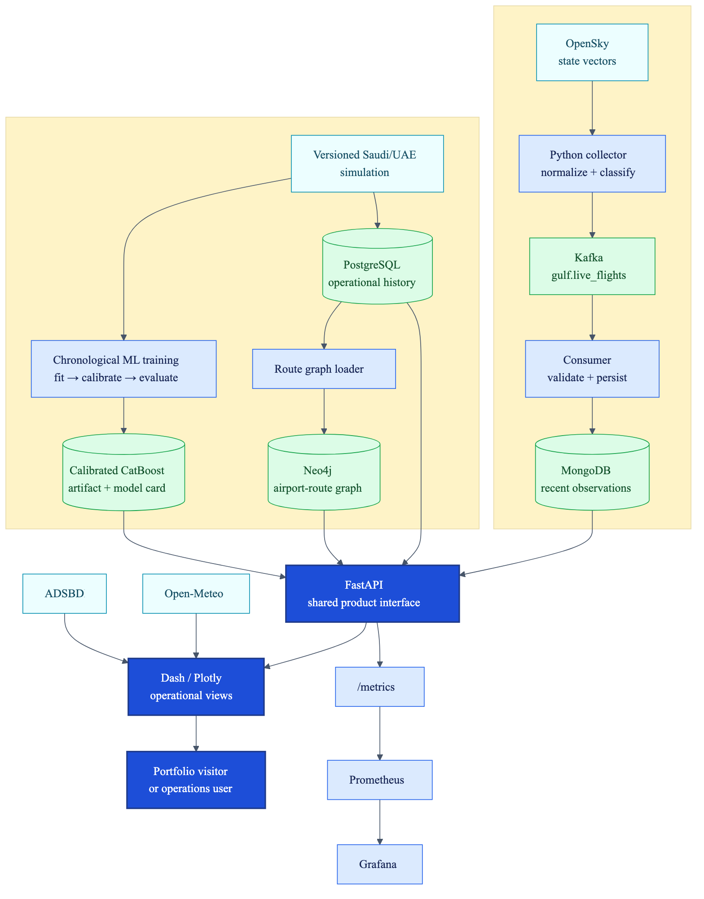

# DST Airlines — Gulf Aviation Intelligence

An end-to-end aviation data product for exploring Saudi Arabian and UAE airspace, operational patterns, airport and airline performance, route networks, and transparent delay-risk scenarios.

**[Open the live application](https://airlines.hassansalamb.dev/)** · **[Architecture](docs/ARCHITECTURE.md)** · **[Operations](docs/operations/DEPLOYMENT.md)**

The project demonstrates how to turn imperfect external aviation data into a useful and honest decision-support experience: current aircraft observations are kept separate from simulated historical operations, and model output is presented as a portfolio scenario rather than an official flight forecast.



## What the product demonstrates

- **Live Airspace** — current community ADS-B aircraft observations across Saudi Arabia and the UAE, using OpenSky first and ADSB.lol when the public host cannot reach OpenSky.
- **Performance Explorer** — airport, airline, route, delay-cause, and flight-level drilldown over a repeatable Saudi/UAE portfolio simulation.
- **AI Delay Lab** — calibrated CatBoost delay-risk scenarios, baseline comparison, chronological evaluation, feature importance, calibration evidence, and model limitations.
- **Data engineering** — OpenSky collection, Kafka events, MongoDB persistence, PostgreSQL analytics, and Neo4j route traversal.
- **DataOps** — containers, Kubernetes validation, Terraform, GitHub Actions, Trivy, Dependabot, Prometheus, Grafana, backup automation, and recovery guidance.

## Data truthfulness

Every product claim belongs to one of three evidence classes:

| Label | Source | Safe interpretation |
|---|---|---|
| `LIVE OBSERVATION` | OpenSky or ADSB.lol community ADS-B observations | Aircraft recently detected within the selected geographic filter |
| `PORTFOLIO SIMULATION` | Versioned synthetic Saudi/UAE operational history | Repeatable analytical demonstration, not real airline performance |
| `MODEL SCENARIO` | Model trained and evaluated on the simulation | What-if delay risk, not a forecast for a scheduled commercial flight |

Neither live ADS-B provider supplies authoritative schedules, gates, cancellations, or delay outcomes. ADSBDB route enrichment is best-effort. Official operational use would require airline data or a commercial source such as Cirium or FlightAware.

The canonical vocabulary is recorded in [CONTEXT.md](CONTEXT.md).

## Architecture

```text
OpenSky → collector → Kafka → MongoDB ─────────────┐
                                                   │
Saudi/UAE simulation → PostgreSQL ─────────────────┼→ FastAPI → Dash / Plotly
           ├→ Neo4j route graph ───────────────────┤
           └→ calibrated CatBoost artifact ────────┘

Open-Meteo + ADSBDB ─────────────────────────────────────────→ dashboard enrichment
FastAPI /metrics → Prometheus → Grafana
```

The architecture is documented at four levels:

1. [System context](docs/ARCHITECTURE.md#level-0--system-context)
2. [End-to-end data flow](docs/ARCHITECTURE.md#level-1--end-to-end-data-flow)
3. [Backend and storage](docs/ARCHITECTURE.md#level-2--backend-and-storage)
4. [Render and Proxmox deployment topology](docs/ARCHITECTURE.md#level-3--deployment-topology)

The editable Mermaid sources and rendered PNG/SVG files live in [`docs/architecture`](docs/architecture).

## Technology choices

| Concern | Technology | Reason |
|---|---|---|
| Product interface | FastAPI | Typed HTTP interface, validation, generated OpenAPI documentation |
| Dashboard | Dash and Plotly | Interactive operational filtering, maps, and analytical charts in Python |
| Live ingestion | Python, OpenSky, Kafka | Normalized observations with a replayable event seam |
| Historical analytics | PostgreSQL | Structured filtering and aggregate queries |
| Recent observations | MongoDB | Flexible, time-oriented aircraft records |
| Route traversal | Neo4j | Explicit airport-route graph and shortest-path queries |
| ML | CatBoost, scikit-learn | Mixed categorical/numerical features, probability calibration, baseline comparison |
| Runtime | Docker Compose, Kubernetes | Reproducible local stack and orchestration evidence |
| Infrastructure | Terraform | Reproducible Docker infrastructure, including a Proxmox-hosted Docker target |
| Observability | Prometheus and Grafana | API and platform health evidence |

The durable trade-offs are recorded in [`docs/adr`](docs/adr).

## Repository map

```text
.
├── api/                         FastAPI interface, Gulf model artifact, tests
├── collector/                   OpenSky producer, Kafka/Mongo consumer, tests
├── dashboard/                   Dash product, charts, data adapters, ML training
├── database/sql/                PostgreSQL schema and deterministic CI fixture
├── docs/
│   ├── adr/                     Architecture Decision Records
│   ├── architecture/            Editable diagrams plus PNG/SVG renders
│   ├── operations/              Deployment, security, and recovery runbooks
│   ├── ARCHITECTURE.md           Multi-level architecture walkthrough
│   ├── CI_CD.md                  Pipeline details
│   └── CI_CD.md                  Pipeline details
├── k8s/                         Kubernetes resources
├── monitoring/                  Prometheus and Grafana configuration
├── scripts/                     Deployment and backup automation
├── terraform/                   Docker infrastructure as code
├── docker-compose.yml           Full local platform
├── docker-compose.dev.yml       Development platform
└── docker-compose.prod.yml      Production-oriented platform
```

Generated scan reports, local datasets, credentials, caches, and runtime output are intentionally excluded from Git.

## Quick local preview

### Prerequisites

- Python 3.11
- Two terminal windows

Create an environment and install the API and dashboard dependencies:

```bash
python3.11 -m venv .venv
source .venv/bin/activate
python -m pip install -r api/requirements.txt -r dashboard/requirements.txt
```

Start FastAPI from the repository root:

```bash
cd api
GULF_MODEL_PATH="$PWD/gulf_delay_model.joblib" \
  uvicorn main:app --host 127.0.0.1 --port 8000
```

In a second terminal using the same environment:

```bash
cd dashboard
API_URL=http://127.0.0.1:8000 python app.py
```

Open:

- Dashboard: `http://127.0.0.1:8050`
- FastAPI documentation: `http://127.0.0.1:8000/docs`
- Model card endpoint: `http://127.0.0.1:8000/model/gulf/status`

The dashboard can use its curated portfolio fallback when the database stack is absent. Live-airspace availability still depends on the upstream community services.

Performance Explorer consolidates carrier, gateway, route and flight-level drilldown into one workspace. Its optional From/Until date range controls every subsection; when left blank, the dashboard uses the sidebar Historical Year and Month Range.

## Full local platform

Copy the development configuration and replace placeholders as needed:

```bash
cp .env.dev.example .env.dev
docker compose --env-file .env.dev -f docker-compose.yml up --build -d
docker compose --env-file .env.dev -f docker-compose.yml ps
```

Service URLs:

| Interface | URL |
|---|---|
| Dashboard | `http://localhost:8050` |
| FastAPI docs | `http://localhost:8000/docs` |
| Neo4j Browser | `http://localhost:7474` |
| Prometheus | `http://localhost:9090` |
| Grafana | `http://localhost:3000` |

Stop the stack without deleting its volumes:

```bash
docker compose --env-file .env.dev -f docker-compose.yml down
```

Use `down --volumes` only when deleting local database state is intentional.

See the complete [deployment guide](docs/operations/DEPLOYMENT.md) for development, production-oriented Compose, Kubernetes, Terraform, and the Proxmox target.

## Live observation pipeline

The collector requests Saudi/UAE OpenSky bounding boxes, normalizes state vectors, assigns a portfolio market boundary and nearest supported gateway, and publishes records to `gulf.live_flights`. The consumer validates and persists recent observations to MongoDB.

```text
OpenSky every 20–60 seconds
        ↓
Python producer
        ↓
Kafka: gulf.live_flights
        ↓
Python consumer
        ↓
MongoDB: live_flights
        ↓
FastAPI: GET /live
```

Gateway assignment is proximity-based. Callsign-derived airline and ADSBDB route matches may be unavailable and must not be treated as official movement data.

## AI Delay Lab

The committed `gulf-delay-portfolio-v1` artifact uses a chronological evaluation design:

| Stage | Year | Purpose |
|---|---:|---|
| Fit | 2023 | Train candidate models |
| Calibrate | 2024 | Calibrate CatBoost probabilities |
| Evaluate | 2025 | Compare on unseen simulated records |

Champion results on the simulated 2025 test set:

| Metric | Calibrated CatBoost | Logistic Regression baseline |
|---|---:|---:|
| ROC-AUC | 0.6280 | 0.6177 |
| PR-AUC | 0.5847 | 0.5876 |
| Brier loss | 0.2353 | 0.2382 |
| Recall at 0.50 | 0.3678 | 0.5485 |

CatBoost was selected for better ranking and probability error; the baseline retains better recall at the default threshold. This is a modest portfolio signal, not production validation. Retrain with:

```bash
cd dashboard
DATABASE_URL=<postgres-url> \
GULF_MODEL_OUTPUT=../api/gulf_delay_model.joblib \
GULF_MODEL_METADATA_OUTPUT=../api/gulf_delay_model.metadata.json \
python train_gulf_ml.py
```

## Tests

Dashboard and collector tests run without external network access by mocking provider responses. API integration tests expect PostgreSQL with the deterministic fixture from `database/sql/test_seed.sql`.

```bash
python -m pip install -r requirements-test.txt

python -m pytest dashboard/test_data.py dashboard/test_charts.py -q
python -m pytest collector/test_gulf_live.py -q

# With DATABASE_URL configured and the Gulf model path available:
python -m pytest api/test_api.py -q
```

GitHub Actions also validates Terraform formatting, builds both images, scans them with Trivy, deploys to a temporary Kind cluster, and smoke-tests the API and dashboard. Kind is CI evidence, not a persistent production environment.

## Deployment status

- Local dashboard and API: implemented and tested.
- Docker Compose: implemented for development, full-stack, and production-oriented runs.
- Kubernetes: manifests and repeatable Kind/Minikube deployment implemented.
- Terraform: Docker infrastructure implemented for local or SSH-connected Docker hosts.
- Render public edge: live dashboard deployment from the `main` branch.
- Proxmox data platform: documented target; do not describe it as live until deployment and restore checks pass.

## Documentation

- [Architecture](docs/ARCHITECTURE.md)
- [Deployment](docs/operations/DEPLOYMENT.md)
- [Security](docs/operations/SECURITY.md)
- [Disaster recovery](docs/operations/DISASTER_RECOVERY.md)
- [CI/CD](docs/CI_CD.md)

## Branch workflow

- `dev` is the integration branch for active development.
- Changes are tested on `dev` before being merged into `main`.
- `main` is the release branch and must remain deployable.
- Only `main` and `dev` are maintained as long-lived branches.

## Collaboration and ownership

This began as a collaborative DataOps project by Hassan Salam Banayeem, Ali Doghan, and Kristian Boroz. The Gulf-focused product redesign, live Saudi/UAE experience, model-intelligence view, and subsequent portfolio refinements were developed by Hassan Salam Banayeem. Git history remains the source of truth for individual changes.

Git history records individual contributions. Simulated and community-sourced data remain explicitly labelled throughout the product and documentation.

## License and data use

No license is currently declared for the repository. Add one before inviting external reuse. External data remains subject to each provider’s terms and attribution requirements.
