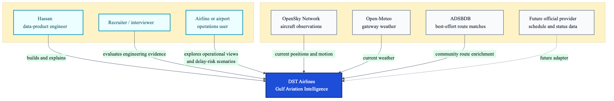
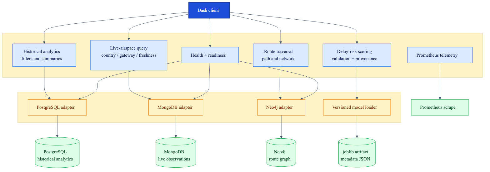
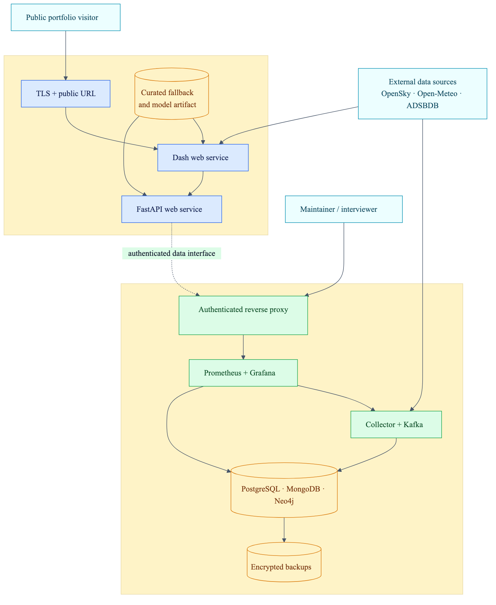

# Architecture

The diagrams use progressively narrower views. Each image is generated from the adjacent Mermaid source so the design remains reviewable and editable.

## Level 0 — system context

Who uses the product, which external sources it depends on, and where an official-data adapter would enter.

[Editable source](architecture/01-system-context.mmd)

## Level 1 — end-to-end data flow

The live-observation and portfolio-simulation lanes remain separate until FastAPI exposes them through one product interface.

[Editable source](architecture/02-end-to-end-data-flow.mmd)

## Level 2 — backend and storage

The backend is organized around user-facing capabilities. Database and model adapters isolate technologies at real seams so the dashboard does not know how data is stored.

[Editable source](architecture/03-backend-and-storage.mmd)

## Level 3 — deployment topology

The target topology separates a lightweight public portfolio edge from continuously running private data infrastructure. The diagram represents the intended Render/Proxmox deployment, not evidence that every target is currently online.

[Editable source](architecture/04-deployment-topology.mmd)

## Evidence and trust boundaries

| Flow | Provenance | What it supports | What it does not prove |
|---|---|---|---|
| OpenSky → collector → Kafka → MongoDB | Live community aircraft observations | Current detected position, altitude, speed, heading and freshness | Official schedule, gate, delay or confirmed origin/destination |
| Saudi/UAE generator → PostgreSQL | Portfolio simulation | Historical filters, operational charts and repeatable testing | Actual airline performance |
| Simulation → calibrated model artifact | Chronological portfolio evaluation | What-if delay-risk scenarios and ML deployment mechanics | A forecast for a real scheduled flight |
| ADSBDB → dashboard | Best-effort community route match | Optional route context for a callsign | Authoritative commercial routing |
| Open-Meteo → dashboard | Current public weather | Gateway weather context | Airport METAR or airline dispatch weather |

## Architectural decisions

- [Hybrid live and simulated evidence](adr/0001-hybrid-live-and-simulated-evidence.md)
- [Storage by access pattern](adr/0002-storage-by-access-pattern.md)
- [Public edge and private data platform](adr/0003-public-edge-private-data-platform.md)
